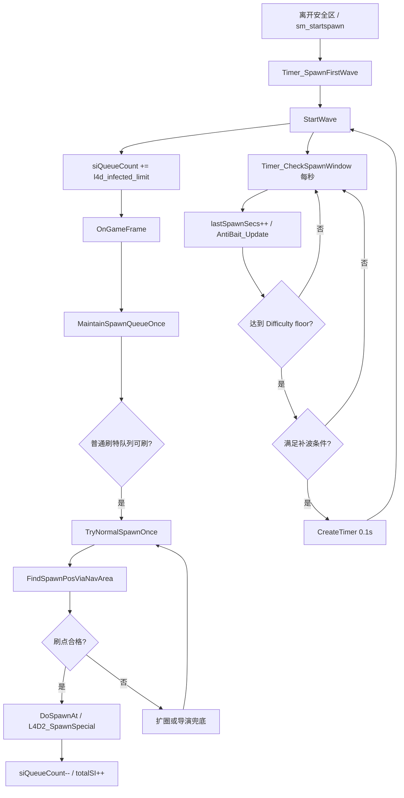
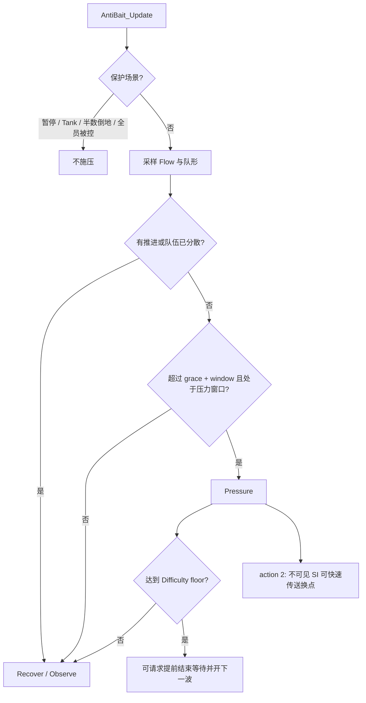

# infected_control 刷特节奏修复报告（2026-06-03）

## 结论

本次按 `/Users/morzlee/Downloads/implementation_plan.md` 和 `/Users/morzlee/Downloads/walkthrough.md` 的实战分析重做刷特节奏修复。

重构后的新版把旧版“条件满足后再等 `versus_special_respawn_interval` 开下一波”的延迟式开波，改成了 floor 到点后 `CreateTimer(0.1)` 立即开波。`0.1s` 本身不是 bug，它只是避免在回调里嵌套开波；真正的问题是旧默认 floor 过低，专家/极限档会落到约 16 秒，实战体感比旧版约 24 秒快很多。

最终方案：

- 提高 `inf_ai_wave_floor_ratio` 默认值为 `1.50 1.40 1.25 1.15 1.10`。
- 保留 `CreateTimer(0.1, Timer_StartNewWave)` 作为异步触发，不恢复旧版长定时器。
- 删除 Pressure 相关的冗余死代码分支，避免维护者误以为 Pressure 能绕过 floor。
- 回收上一轮“上一只实际刷出时间戳”方案，避免普通刷出和传送重刷之间出现新的节奏副作用。

## 修复范围

| 文件 | 变更 |
| --- | --- |
| `addons/sourcemod/scripting/optional/AnneHappy/infected_control/config.inc` | 默认 `inf_ai_wave_floor_ratio` 调整为 `1.50 1.40 1.25 1.15 1.10` |
| `addons/sourcemod/scripting/optional/AnneHappy/infected_control/wave_control.inc` | 删除 Pressure 冗余死代码分支；补充 `0.1s` timer 设计说明 |
| `addons/sourcemod/scripting/optional/AnneHappy/infected_control.sp` | `GetNextSpawnTime` 返回当前 floor 剩余时间，不再固定返回基础 16s |
| `addons/sourcemod/plugins/optional/AnneHappy/infected_control.smx` | 已重新编译更新 |

## 不同难度时序

假设 `versus_special_respawn_interval = 16`：

| 难度档 | 开始判定比例 | 开始判定时间 | Floor 比例 | 最早普通补波 |
| --- | ---: | ---: | ---: | ---: |
| 1 简单 | 0.90 | 14.4s | 1.50 | 24.0s |
| 2 普通 | 0.80 | 12.8s | 1.40 | 22.4s |
| 3 困难 | 0.65 | 10.4s | 1.25 | 20.0s |
| 4 专家 | 0.50 | 8.0s | 1.15 | 18.4s |
| 5 极限 | 0.35 | 5.6s | 1.10 | 17.6s |

说明：

- “开始判定”只是允许插件观察是否满足低存活、全杀手死亡、anti-baiter 等条件。
- “最早普通补波”才是 `StartWave()` 可被安排的下限。
- `AntiBait_ShouldStartWaveEarly()` 内部仍调用 `DifficultyStrategy_CanStartNormalWave()`，所以 Pressure 不会绕过 floor 开新波。
- `inf_antibait_action 2` 的快速传送仍保留，用于把不可见的存活 SI 换点；它不是新增普通补波。

## 刷特流程设计图



## Anti-baiter 压力流程图



## 性能分析

- 本次修复不增加 Nav 扫描、可视 trace、路径检查次数，只调整时间阈值和删除不可达分支。
- `OnGameFrame` 仍由 `inf_FrameThinkStep` / `inf_FrameThinkStepActive` 节流。
- `FindSpawnPosViaNavArea` 仍受 Flow 分桶、候选预算和桶计数缓存限制。
- anti-baiter 仍是每秒采样生还者 Flow 与队形，复杂度主要为生还者两两距离，成本远小于刷点搜索。

## 验证

需要通过：

```bash
git diff --check

./addons/sourcemod/scripting/spcomp \
  -i/Users/morzlee/Documents/GitHub/CompetitiveWithAnne/addons/sourcemod/scripting/include \
  -i/Users/morzlee/Documents/GitHub/CompetitiveWithAnne/addons/sourcemod/scripting/sourcemod/include \
  -i/Users/morzlee/Documents/GitHub/CompetitiveWithAnne/addons/sourcemod/scripting/optional/AnneHappy \
  -o/Users/morzlee/Documents/GitHub/CompetitiveWithAnne/addons/sourcemod/plugins/optional/AnneHappy/infected_control.smx \
  /Users/morzlee/Documents/GitHub/CompetitiveWithAnne/addons/sourcemod/scripting/optional/AnneHappy/infected_control.sp
```

还需要确认：

- 不存在上一轮“按最后一次普通刷出时间额外计时”的残留。
- 不存在 `DoSpawnAt(..., true/false)` 残留。
- 不存在 Pressure 冗余死代码分支。
- 16s 下各难度最早普通补波为 `24.0 / 22.4 / 20.0 / 18.4 / 17.6`。
