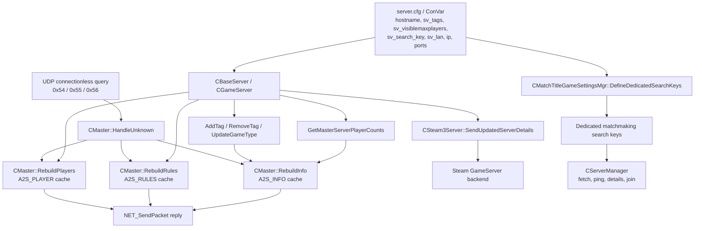

# L4D2 master / A2S / dedicated matchmaking 研究报告

本文基于 2026-05-28 对 L4D2node Binaries 站点的页面阅读与函数索引抓取，重点研究：

- `engine_srv.so` 中 master、A2S、server query 相关类；
- `matchmaking_ds_srv.so` 中 dedicated server matchmaking 管理逻辑；
- A2S / master 字段来源；
- 可用于兼容性修复的观察点；
- 不建议通过 patch 或伪造字段做排名作弊的原因。

参考页面：

- L4D2node Binaries 首页：https://binaries.l4d2node.org/
- `engine_srv.so` 索引：https://binaries.l4d2node.org/b/engine_srv.so/
- `matchmaking_ds_srv.so` 索引：https://binaries.l4d2node.org/b/matchmaking_ds_srv.so/
- Valve Server Queries 文档：https://developer.valvesoftware.com/wiki/Server_queries
- Steamworks Game Servers 文档：https://partner.steamgames.com/doc/features/multiplayer/game_servers

## 结论摘要

`engine_srv.so` 的 `CMaster` 是传统 master heartbeat 与 A2S 响应缓存/发送的核心类。它负责处理 `A2S_INFO`、`A2S_RULES`、`A2S_PLAYER` 等 connectionless UDP 查询，并把 `CBaseServer` / `CGameServer` / ConVar / Steam3 状态序列化成响应包或 heartbeat info-string。

`CSteam3Server` 是 Steam GameServer API updater 的封装层。它负责激活 Steam game server、选择端口、处理 Steam 回调、把服务器名/目录/map/password/人数等状态同步给 Steam 后端。反编译中大量 Steam API 通过虚表调用出现，函数名不总是直接可见，因此本文对它们的 API 名称只在与 Steamworks 文档吻合时作为推断。

`matchmaking_ds_srv.so` 的 `CServerManager` 更像客户端/匹配侧的服务器列表管理器：拉取 group / LAN / internet 服务器、请求详情、计算 ping、处理 `GameDetailsServer` KeyValues。`CMatchTitleGameSettingsMgr::DefineDedicatedSearchKeys` 会生成 dedicated 搜索键，显式使用 `Game/mode`、`sv_search_key`、扩展接口提供的数值和地图配置 tag。它不是一个“改 A2S 字段就能排第一”的入口。

从代码路径看，能合规调整的是：服务器名、地图、模式、`sv_tags`、`sv_search_key`、公开/密码状态、端口/NAT、`sv_visiblemaxplayers` 等真实配置。不要 patch `CMaster::HandleUnknown`、`CMaster::RebuildInfo` 或 `CSteam3Server::SendUpdatedServerDetails` 去伪造人数、secure、map、tags 或低 ping；这会破坏 Steam 后端、客户端筛选和玩家体验的一致性。

## `engine_srv.so` 相关类

### `CMaster`

类页：https://binaries.l4d2node.org/b/engine_srv.so/c/CMaster

抓取到的主要函数：

| 函数 | 地址 | 作用判断 |
| --- | --- | --- |
| `CMaster::Init` | `0x00201570` | 初始化 master 相关状态 |
| `CMaster::Heartbeat_Legacy_f` | `0x00201590` | 控制台 legacy heartbeat 命令 |
| `CMaster::SetMaster_Legacy_f` | `0x00201a50` | legacy master 地址配置 |
| `CMaster::InitConnection` | `0x00201f60` | 初始化到 master 的连接/地址列表 |
| `CMaster::GetHeartbeat` | `0x00202920` | 为某个 master/server 组合取或创建 heartbeat 状态 |
| `CMaster::SendHeartbeat` | `0x00202a90` | 构造并发送 legacy heartbeat info-string |
| `CMaster::CheckHeartbeat` | `0x002032b0` | 周期性检查是否需要发 heartbeat |
| `CMaster::RebuildInfo` | `0x002034e0` | 构造缓存的 A2S_INFO 响应 |
| `CMaster::RebuildRules` | `0x00203870` | 构造缓存的 A2S_RULES 响应 |
| `CMaster::ReplyInfo` | `0x00203a50` | 发送 A2S_INFO 响应 |
| `CMaster::ReplyRules` | `0x00203b00` | 发送 A2S_RULES 响应 |
| `CMaster::RebuildPlayers` | `0x00204170` | 构造缓存的 A2S_PLAYER 响应 |
| `CMaster::ReplyPlayers` | `0x002043b0` | 发送 A2S_PLAYER 响应 |
| `CMaster::HandleUnknown` | `0x00204460` | 分发 connectionless query 字节，如 `0x54`、`0x55`、`0x56` |

`CMaster::HandleUnknown` 是 A2S 入口。反编译显示它读取 connectionless 包的命令字节：

- `0x54`：读取 `"Source Engine Query"` 字符串，验证 `CBaseServer::ValidInfoChallenge`，再走 `ReplyInfo`；
- `0x55`：验证 challenge 后走 `ReplyPlayers`；
- `0x56`：验证 challenge 后走 `ReplyRules`；
- 另有 legacy master / gamedata ack 相关分支。

这和 Valve 文档中的 A2S 命令对应：

- `A2S_INFO` 请求使用 `0x54`；
- `A2S_PLAYER` 请求使用 `0x55`；
- `A2S_RULES` 请求使用 `0x56`；
- challenge 响应用 `0x41`。

### A2S_INFO 字段来源

`CMaster::RebuildInfo` 地址：https://binaries.l4d2node.org/b/engine_srv.so/f/0x002034e0

它用 `bf_write` 构造响应：

1. 写入 `-1` header；
2. 写入 `0x49`，即 A2S_INFO response；
3. 写入 protocol；
4. 写入服务器名；
5. 写入地图名；
6. 写入 `com_gamedir` 的 basename；
7. 写入 game description；
8. 写入 Steam app id；
9. 写入玩家数、最大玩家数、bot 数；
10. 写入 server type、environment、password、VAC；
11. 写入版本；
12. 根据 EDF 追加 port、SteamID、SourceTV、keywords/tags 等扩展字段。

可以对应到公开 A2S_INFO 格式：

| A2S 字段 | 反编译中观察到的来源 |
| --- | --- |
| name | `CBaseServer::GetName` 类似虚表调用 |
| map | `CBaseServer` 当前 map 虚表调用 |
| folder | `V_FileBase(com_gamedir, ...)` |
| game | `serverGameDLL` 返回的 game description |
| appid | `GetSteamAppID()` |
| players/max/bots | `CBaseServer::GetMasterServerPlayerCounts` |
| server type | dedicated / proxy / listen 状态分支 |
| environment | Linux server 写入 `0x6c` / `'l'` |
| password | `CBaseServer::GetPassword` / password 状态 |
| VAC | Steam3 server policy / secure 状态 |
| version | `GetHostVersionString()` |
| port | EDF `0x80` 分支 |
| tags / keywords | EDF `0x20` 分支，来源与 `sv_tags` / game type 相关 |

`CMaster::ReplyInfo` 地址：https://binaries.l4d2node.org/b/engine_srv.so/f/0x00203a50

它会先检查 `CBaseServer::ShouldHideServer()`，再按 0.25 秒缓存窗口决定是否调用 `RebuildInfo`，最后用 `NET_SendPacket` 把缓存 buffer 发回请求方。因此 A2S_INFO 不应该被理解成“每个查询实时任意生成”，而是有短缓存与隐藏状态检查的。

### 人数来源

`CBaseServer::GetMasterServerPlayerCounts` 地址：https://binaries.l4d2node.org/b/engine_srv.so/f/0x00109fc0

反编译显示它读取：

- `GetNumHumanPlayers(this)`；
- `GetMaxHumanPlayers(this)`；
- `GetNumFakeClients(&sv)`；
- 如果 `sv_visiblemaxplayers > 0`，会覆盖 max；
- 最后 bot count 被置为 `0`。

这解释了为什么 L4D2 的 master/A2S 可见最大人数可能受 `sv_visiblemaxplayers` 影响，也解释了 bots 字段在某些情况下和真实 fake client 不一致。兼容性修复时可以优先检查 `sv_visiblemaxplayers`、slot 插件、保留位插件和实际 `maxplayers` 是否一致。

### tags / gametype 来源

`CBaseServer::AddTag` 地址：https://binaries.l4d2node.org/b/engine_srv.so/f/0x00109550  
`CBaseServer::RemoveTag` 地址：https://binaries.l4d2node.org/b/engine_srv.so/f/0x00109370

`AddTag` / `RemoveTag` 都直接维护 `sv_tags` 字符串，使用逗号分隔。`AddTag` 会避免重复 tag，带 value 前缀时会先移除旧值再添加新值。`RemoveTag` 支持按完整 tag 或前缀移除。

`CMaster::SendHeartbeat` 还会调用 `CBaseServer::UpdateGameType`，再把 `type`、`tags`、`gamedata` 等写入 legacy heartbeat info-string。报告中的结论是：tags 的合规入口是 `sv_tags` 和游戏模式/插件设置，不是 patch `CMaster::RebuildInfo`。

### Legacy heartbeat

`CMaster::CheckHeartbeat` 地址：https://binaries.l4d2node.org/b/engine_srv.so/f/0x002032b0

`CheckHeartbeat` 在 legacy mode 下周期性向 master 发一个字节 `'q'`，受以下条件影响：

- `sv_master_legacy_mode` / `IsUsingMasterLegacyMode()`；
- server active / loaded 状态；
- `CBaseServer::ShouldHideFromMasterServer`；
- heartbeat timeout；
- master 地址列表。

`CMaster::SendHeartbeat` 地址：https://binaries.l4d2node.org/b/engine_srv.so/f/0x00202a90

`SendHeartbeat` 构造 key/value info-string，观察到的字段包括：

- `protocol`
- `challenge`
- `bots`
- `players`
- `max`
- `gamedir`
- `map`
- `password`
- `os`
- `lan`
- `region`
- `type`
- `secure`
- `version`
- `product`
- load average / game data 相关字段

这条路径是 legacy master heartbeat，不等同于 Steam GameServer API 的全部注册逻辑。现代可见性更应关注 Steam3 server 是否正常激活、端口是否正确、Steam 后端是否能看到 query port。

### Steam master updater 共享 socket

`CSteam3Server::IsMasterServerUpdaterSharingGameSocket` 地址：https://binaries.l4d2node.org/b/engine_srv.so/f/0x002112c0  
`CBaseServer::ForwardPacketsFromMasterServerUpdater` 地址：https://binaries.l4d2node.org/b/engine_srv.so/f/0x001091b0

`ForwardPacketsFromMasterServerUpdater` 会从 Steam3 master updater 读取收到的 UDP 包，再用 `NET_SendPacket` 从 game socket 转发出去。这说明 L4D2 server 有“Steam updater 与 game socket 共享/转发”的兼容路径。实际排障时如果 A2S 查不到、Steam master 能看到但客户端进不来，应该重点检查：

- `-steamport`；
- `+hostport` / `+clientport`；
- query port；
- `sv_master_share_game_socket`；
- NAT/防火墙是否允许 UDP 回包；
- 服务器绑定 IP 是否和外部可达 IP 匹配。

### `CSteam3Server`

类页：https://binaries.l4d2node.org/b/engine_srv.so/c/CSteam3Server

关键函数：

| 函数 | 地址 | 作用判断 |
| --- | --- | --- |
| `CSteam3Server::Activate` | `0x00211680` | 激活 Steam game server，设置 IP/端口/目录/模式，登录并发送初始详情 |
| `CSteam3Server::SendUpdatedServerDetails` | `0x00211500` / `0x00211650` | 推送服务器详情更新 |
| `CSteam3Server::RunFrame` | `0x00211f20` | 周期性跑 Steam callbacks / updater |
| `CSteam3Server::NotifyOfLevelChange` | `0x00211ee0` | 地图变化后触发详情更新 |
| `CSteam3Server::NotifyOfServerNameChange` | `0x00211f10` | 服务器名变化后触发详情更新 |
| `CSteam3Server::UpdateSpectatorPort` | `0x00211010` | 更新 SourceTV spectator port |
| `CSteam3Server::OnGSPolicyResponse` | `0x00210870` | VAC / secure policy 回调 |
| `CSteam3Server::OnLogonSuccess` | `0x00211b60` | Steam server 登录成功回调 |

`Activate` 中可观察到：

- `sv_lan` 会影响 server mode；
- `-steamport` 命令行参数会覆盖默认 Steam port；
- `ip` ConVar 会影响绑定/上报 IP；
- `V_FileBase(com_gamedir, ...)` 作为 game dir；
- `NET_GetUDPPort(1)` / `NET_GetUDPPort(2)` 用于 game / SourceTV 端口；
- `sv_master_share_game_socket` 和 legacy mode 会影响 updater socket 选择；
- 末尾调用 `SendUpdatedServerDetails`。

`SendUpdatedServerDetails` 中可观察到：

- 读取 `CBaseServer::GetMasterServerPlayerCounts`；
- 推送 max players、bot count、password protected、server name；
- 推送 game dir；
- 推送 map name，SourceTV relay 时走 hltv map，否则走普通当前 map。

结合 Steamworks 文档，这些虚表调用大概率对应 `ISteamGameServer` / `ISteamGameServer_Beta` 类接口中的 `SetMaxPlayerCount`、`SetBotPlayerCount`、`SetPasswordProtected`、`SetServerName`、`SetGameDir`、`SetMapName`、`LogOnAnonymous` / `LogOff` / callback dispatch 等。不过页面显示的是虚表间接调用，不总能直接给出函数名，因此这是“与公开 API 对照后的解释”，不是页面直接打印出的符号名。

## `matchmaking_ds_srv.so` 相关类

### `CServerManager`

类页：https://binaries.l4d2node.org/b/matchmaking_ds_srv.so/c/CServerManager

关键函数：

| 函数 | 地址 | 作用判断 |
| --- | --- | --- |
| `GetNumServers` | `0x0005a010` | 当前列表服务器数量 |
| `GetServerByIndex` | `0x0005a020` | 按索引取服务器 |
| `GetServerRecordByOnlineId` | `0x0005a220` | 按 online id / xuid 查找记录 |
| `UpdateLanSearch` | `0x0005a390` | LAN 搜索更新 |
| `RemoveOldServers` | `0x0005a600` | 移除旧服务器记录 |
| `RequestPingingDetails` | `0x0005a6a0` | 请求 internet server details / ping details |
| `OnEvent` | `0x0005a8b0` | 处理 LAN / internet / connect server details 事件 |
| `MarkOldServersAndBeginSearch` | `0x0005b180` | 标记旧数据并开始搜索 |
| `OnAllDataFetched` | `0x0005b290` | 数据全部返回后的收尾 |
| `UpdateRequestingDetails` | `0x0005b450` | 刷新请求详情状态 |
| `EnableServersUpdate` | `0x0005b4d0` | 启停服务器列表更新 |

`RequestPingingDetails` 会创建 `InetSearchServerDetails` KeyValues，遍历服务器列表，并受：

- `mm_server_search_inet_ping_window`
- `mm_server_search_inet_ping_timeout`

影响。它会写入 `timestamp`，并在等待/超时时移除旧服务器或继续请求。

`OnEvent` 会处理 `OnNetLanConnectionlessPacket`，查找：

- `LanSearchServerPing`
- `ConnectServerDetailsRequest`
- `InetSearchServerDetails`
- `GameDetailsServer`

如果 `GameDetailsServer/LanSearchServerPing/timestamp` 存在，它会用 `Plat_FloatTime` 计算 ping，限制到 0 到 999ms。对于 internet details，它会按 online id 找 `CServer` 记录，读取 `Server/adronline` 等地址字段，并把详情交给匹配扩展接口。

重点：这里的 ping 是收到响应时根据 timestamp 算出来的，不是服务器在 A2S payload 里自报一个 ping 字段。这与 Steam/Source 浏览器中 ping 是客户端侧 RTT 的结论一致。

### `CServer`

类页：https://binaries.l4d2node.org/b/matchmaking_ds_srv.so/c/CServer

函数很少：

- `GetOnlineId`
- `GetGameDetails`
- `IsJoinable`
- `Join`

它更像匹配侧服务器记录对象，保存 online id、game details、joinable 状态，并提供加入入口。它不是 A2S 响应生成方。

### `CMatchTitleGameSettingsMgr`

类页：https://binaries.l4d2node.org/b/matchmaking_ds_srv.so/c/CMatchTitleGameSettingsMgr

关键函数：

| 函数 | 地址 | 作用判断 |
| --- | --- | --- |
| `ExtendServerDetails` | `0x00039220` | 扩展服务器详情 KeyValues |
| `RollupGameDetails` | `0x00039a20` | 汇总 game details |
| `DefineDedicatedSearchKeys` | `0x0003a000` | 定义 dedicated server 搜索键 |
| `DefineSessionSearchKeys` | `0x0003a200` | 定义 session 搜索键 |
| `InitializeGameSettings` | `0x0003ac00` / `0x0003b270` | 初始化 GameSettings |
| `PrepareLobbyForGame` | `0x0003c2e0` | lobby 进入游戏前准备 |

`DefineDedicatedSearchKeys` 地址：https://binaries.l4d2node.org/b/matchmaking_ds_srv.so/f/0x0003a000

反编译显示：

- 读取 `Game/mode`，默认 `"coop"`；
- 通过 `g_pMatchExtL4D` 查模式信息与地图信息；
- 读取地图配置里的 `BuiltIn` / `CfgTag`；
- 懒加载 `sv_search_key`；
- 拼接格式类似：
  - `"%s,key:%s%d,%s"`
  - 或 `"%s,key:%s%d"`
- 写入 `SearchKeys/gamedata`。

这对 dedicated 匹配非常关键。`sv_search_key` 与模式、地图配置 tag 组成搜索键，影响“哪些 lobby / session 会搜索到你的 dedicated server”。它不是排序分数，而是匹配过滤/归类信号。

### `CMatchNetworkMsgControllerBase`

类页：https://binaries.l4d2node.org/b/matchmaking_ds_srv.so/c/CMatchNetworkMsgControllerBase

关键函数：

- `GetActiveServerGameDetails`：生成当前 server details；
- `PackageGameDetailsForQOS`：把 details 打包给 QOS；
- `UnpackGameDetailsFromQOS`：解析 QOS 返回的 details；
- `PackageGameDetailsForReservation`：预约/保留服务器时打包 game details。

`GetActiveServerGameDetails` 地址：https://binaries.l4d2node.org/b/matchmaking_ds_srv.so/f/0x000595e0

观察到它构造 `GameDetailsServer` KeyValues 模板：

```text
System { network LIVE access public }
Server { name = server = adronline = adrlocal = }
Members { numSlots #int#0 numPlayers #int#0 }
```

随后写入：

- `Server/name`
- `Server/server`，值为 `dedicated` 或 `listen`
- `Server/adronline`
- `Server/adrlocal`
- `Members/numSlots`
- `Members/numPlayers`

这表明 dedicated matchmaking 使用的是比 A2S_INFO 更高层的 KeyValues game details / QOS 模型。A2S 公开字段和 dedicated matchmaking details 有重叠，但不是同一个数据包，也不能简单认为“改 A2S 就改匹配排名”。

## 字段流向图



## 兼容性修复建议

### 1. A2S 查不到或超时

优先检查：

- `sv_lan 0`；
- UDP game/query port 是否开放；
- `+hostport`、`+clientport`、`-steamport` 是否冲突；
- NAT 是否把回包源端口改乱；
- `ip` ConVar 是否绑定到不可达内网地址；
- `sv_master_share_game_socket` 是否和部署方式匹配；
- 服务器是否 hibernating / hidden；
- 是否触发 A2S challenge，而查询工具没有二次带 challenge。

对应观察点：

- `CMaster::HandleUnknown` 是否收到 `0x54/0x55/0x56`；
- `CBaseServer::ValidInfoChallenge` / `ValidChallenge` 是否拒绝；
- `CMaster::ReplyInfo` 是否因 `ShouldHideServer` 不回；
- `ForwardPacketsFromMasterServerUpdater` 是否正在共享 socket 转发。

### 2. A2S 字段不对

按字段查：

- 服务器名：检查 `hostname` 和 `NotifyOfServerNameChange`；
- 地图：检查当前 map、SourceTV relay 状态；
- folder：检查 `com_gamedir`；
- game description：来自 game dll；
- players/max：检查真实玩家、slot 插件、`sv_visiblemaxplayers`；
- tags：检查 `sv_tags`、插件调用 `AddTag/RemoveTag`、逗号分隔格式；
- VAC/secure：检查 Steam3 登录与 `OnGSPolicyResponse`；
- port：检查 `NET_GetUDPPort`、启动参数和 NAT。

### 3. Steam 组浏览器或 matchmaking 不稳定

优先检查：

- Steam game server 是否登录成功；
- `CSteam3Server::RunFrame` 是否持续执行；
- `SendUpdatedServerDetails` 是否在地图/名字变化后触发；
- `sv_search_key` 是否和你的 lobby / matchmode 一致；
- `Game/mode`、地图配置 `CfgTag` 是否和玩家搜索条件匹配；
- `Server/adronline` 是否是外部可连地址；
- 服务器是否有空位、无密码或密码状态真实。

## 不建议 patch 排名作弊的原因

### 1. ping 不是 A2S payload 字段

`CServerManager::OnEvent` 明确使用本地 timestamp 和当前时间差计算 LAN / details ping，并限制到 0 到 999ms。Steam/Source 浏览器同理通常由客户端发 UDP 查询后按 RTT 算。服务器无法通过 `A2S_INFO` 里的一个字段把 ping 自报为 5ms。

### 2. 伪造人数和 tags 会破坏多条链路一致性

人数至少出现在：

- `CMaster::RebuildInfo` 的 A2S_INFO；
- `CMaster::SendHeartbeat` 的 legacy heartbeat；
- `CSteam3Server::SendUpdatedServerDetails` 的 Steam 后端状态；
- `GetActiveServerGameDetails` / QOS / matchmaking KeyValues。

只 patch 一个点，其他链路仍会暴露真实状态；全链路 patch 则风险大、维护成本高，而且很容易造成客户端筛选、Steam 后端、玩家进服体验互相矛盾。

### 3. 搜索键是匹配过滤，不是任意排名分

`DefineDedicatedSearchKeys` 显示 dedicated 搜索键由 mode、`sv_search_key` 和地图配置 tag 组成。乱填 key 不会让服务器“排最前”，更可能让正确的 lobby 搜不到你，或者搜到后无法匹配规则。

### 4. 反编译 patch 维护风险高

L4D2 更新后函数地址、虚表布局、签名都可能变化。页面里很多函数 Windows 地址/签名为空，Linux 地址也只是当前 binary 的符号索引。把核心 query / Steam updater patch 成自定义逻辑，长期维护成本远高于正确配置和网络优化。

## 推荐优化路线

合规提升可见度应从这些点做：

1. 网络路径真实变好：目标玩家附近部署机器或 relay，确保实际 UDP RTT 低。
2. 端口明确：固定 `+hostport`、`+clientport`、`-steamport`，避免 NAT 回包错端口。
3. 服务器名清晰：地区、模式、难度、语言、tick / 插件特色写清楚。
4. tags 真实：`sv_tags` 用于描述模式、地区、语言、插件，不塞垃圾关键词。
5. `sv_search_key` 统一：你的 lobby / matchmode / server cfg 保持一致。
6. 人数真实：不要伪造满服或虚假空位，保留位插件要和 `sv_visiblemaxplayers` 一致。
7. Steam 登录稳定：观察 `CSteam3Server::OnLogonSuccess`、`OnGSPolicyResponse` 相关日志。
8. 用 A2S 工具从外网测：确认外部看到的 name/map/players/tags/port 与预期一致。

## 对本仓库可做的后续工作

本仓库已有 `tools/a2s-proxy/`，可用于：

- 查询 A2S_INFO；
- 发送原始 A2S payload；
- 普通 UDP relay；
- 从不同外部机器验证真实 RTT 与字段。

下一步可以增加一个“字段一致性检查”脚本：

- 同时读取 A2S_INFO、A2S_RULES；
- 输出 `hostname`、`sv_tags`、`sv_visiblemaxplayers`、`sv_lan`、`sv_region`、`sv_search_key`；
- 与配置文件里的预期值做 diff；
- 把端口/NAT/Steam updater 异常列成诊断建议。

这样比 patch binary 更适合长期维护，也更容易定位“为什么匹配不到 / 浏览器不显示 / 字段不一致”的实际问题。
